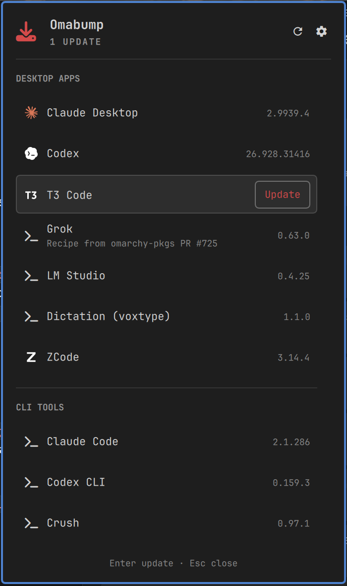
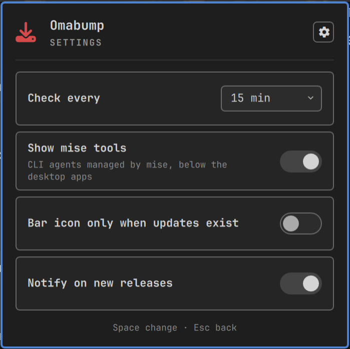

# Omabump

Agent desktop apps and CLIs at the version the vendor shipped, ahead of the Omarchy repo.

## What it shows

An Omarchy bar widget. It lists the agent desktop apps and agent CLIs installed on this machine, the installed and the newest version of each, and installs the newest version in a terminal when you press Update. It never installs anything on its own. The project was previously called Agent Apps.



The bar icon turns the urgent colour when an app can be updated. Left click opens the panel, middle or right click checks now. The tooltip and the panel header say one of: all current, N updates, check failed, or last known (rows that keep an earlier run's version because this run could not get one). A failed check never reads as up to date.

The panel has two sections, Desktop apps and CLI tools. Apps are found with `pacman -Q` (exact package names) and CLIs with `mise ls`. A row shows the installed version, or `installed → newest` when there is an update. A second line appears only for an exception: a pin, a recipe from an open omarchy-pkgs PR, another package name, a failed check, no install route. The row's tooltip says where the version came from and what Update runs.

| Package | App | Route |
|---|---|---|
| `claude-desktop` | Claude Desktop | omarchy |
| `openai-codex-desktop` | Codex (also found as AUR `chatgpt-desktop`) | omarchy |
| `t3code-bin` | T3 Code | omarchy |
| `hermes-desktop` | Hermes | omarchy, no Update until the recipe has an upstream watch |
| `grok-bot` | Grok | omarchy, recipe from omarchy-pkgs PR #725 |
| `lmstudio-bin` | LM Studio | omarchy |
| `openclaw` | OpenClaw | omarchy |
| `perplexity` | Perplexity | omarchy |
| `voxtype-bin` | Dictation (voxtype) | omarchy |
| `zcode` | ZCode (also found as AUR `z-code-bin`) | vendor |
| `antigravity` | Antigravity (or `antigravity-appimage`) | indicator, version from the AUR |
| `antigravity-ide` | Antigravity IDE | indicator, version from the AUR |
| `kimi-bin` | Kimi | indicator, version from Moonshot's update feed |
| `trae-bin` | Trae | indicator, version from the AUR |

mise tools, listed when mise has them installed and active: every coding agent Omarchy offers (Claude Code, Codex CLI, Crush, OpenCode, Grok CLI, Copilot CLI, Cursor CLI, Pi, Oh My Pi, Ori, Antigravity CLI, Muse Code and whatever Omarchy adds later, see How CLI tools are found), plus Gemini CLI, Jules, Qwen Code, Kimi CLI, Amp and herdr.

### How CLI tools are found

Omarchy lists its coding agents in its menu, as the entries `setup.default.agent.<command>` of `/usr/share/omarchy/default/omarchy/omarchy-menu.jsonc` and of your `~/.config/omarchy/extensions/omarchy-menu.jsonc`, and installs each one on first use through `omarchy-mise-install`, which writes `~/.local/bin/<command>`:

```sh
#!/bin/bash
export MISE_MINIMUM_RELEASE_AGE=0
mise use -g --quiet "<package>" || exit 1
exec mise x "<package>" -- "<bin>" "$@"
```

Every check, `bin/omabump-discover` reads both as text. Of a menu entry it uses the command and the label, never `action`, `when` or `checked`. A wrapper counts only when it is a regular file you own (not a symlink), at most 4 KiB, and exactly the four lines above with the same package twice and no `$`, backtick, `\`, `"` or `!` in it; it is opened, never run or sourced. The package, without a trailing `[options]` suffix (`http:muse[url=...]` is `http:muse`), is the key `mise ls` reports. Without such a wrapper the command itself is the key, used only when mise has exactly that tool installed and active. So when Omarchy moves an agent to another mise package, the row follows it.

A discovered agent joins the shipped row whose `command` is its command or whose `tool` list holds its key, which keeps the shipped name and icon; otherwise it gets a row `mise:<command>` with the menu's label. `{"pkg": "mise:<command>", "disabled": true}` in your `apps.json` hides it for good. When the menu cannot be read, the panel footer says "Agent discovery failed" and the shipped rows still show.

`mise outdated` is asked only about the key each row resolved to, and only when `mise ls --backend` puts it on one of mise's own backends: aqua, github, gitlab, forgejo, npm, http, ubi, cargo, go, pipx, gem, core. A tool that resolves through asdf, vfox or another plugin backend shows its installed version and "Update check skipped", and has no Update button: resolving its versions would run the plugin's scripts. `mise ls` itself, which Omabump does call, may still resolve the requests in your mise config before it filters its output.

## Install

```sh
omarchy plugin add https://github.com/vladkarok/omabump.git --enable
```

`omarchy plugin add` asks for confirmation; from a script pass `--yes`.

### Updating Omabump

`omarchy update` updates Omarchy and your packages, not plugins. So Omabump checks its own GitHub release too: when a newer one exists, the panel shows a PLUGIN section with an Omabump row (hidden while it is current). Update runs `omarchy plugin update io.github.vladkarok.omabump --yes` in a terminal, which fetches the plugin clone's origin, fast-forwards it, validates the manifest and reloads the shell's plugins; if the panel still shows the old version, `omarchy restart shell`. That command installs the repository's current HEAD, not the release the row named: Omarchy's installer does not enforce the marketplace's verified snapshot. A plugin directory that is a symlink or has no `.git` (a developer checkout) shows "Local checkout, update it with git" and no Update button. Mute and skip work on this row too (`self:omabump`).

The widget lands in the bar's right section. Move it with `omarchy bar move io.github.vladkarok.omabump --section center --index 0` (sections: left, center, right).

## Remove

```sh
omarchy plugin remove io.github.vladkarok.omabump
```

That leaves the cache (the omarchy-pkgs clone, downloaded recipe sources, any failed build) and the state directory (the last check, which versions were announced). Remove them with:

```sh
rm -rf ~/.cache/omabump
rm -rf ~/.local/state/omarchy/plugins/io.github.vladkarok.omabump
rm -rf ~/.config/omarchy/omabump   # only if you created overrides
sudo rm -rf /var/cache/omabump     # only after a failed install left a staged package
```

Packages Omabump installed stay installed; pacman manages them like any other.

## Prerequisites

- `base-devel` (makepkg, sudo) and `git`
- `jq`, `curl`, `python` 3.11 or newer, `libarchive` (`bsdtar`): what omarchy-pkgs' `bin/sync-upstream` needs
- sudo rights for `pacman -U`
- `mise`, optional, for the agent CLIs

When something is missing, omarchy rows have no Update button and say what to install, for example "Missing: makepkg, jq; sudo pacman -S --needed base-devel jq".

### External services contacted

The background check (every 15 minutes by default) fetches version feeds:

- `downloads.claude.ai` (Claude Desktop apt index)
- `persistent.oaistatic.com` (Codex apt index)
- `packages.perplexity.ai` (Perplexity apt index)
- `downloads.cursor.com` (Grok apt index)
- `github.com` (`/releases/latest` redirects for T3 Code, Hermes, voxtype and Omabump itself; the omarchy-pkgs clone)
- `registry.npmjs.org` (OpenClaw)
- `lmstudio.ai` (LM Studio download page)
- `zcode.z.ai` (ZCode update manifest)
- `kimi-img.moonshot.cn` (Kimi update feed)
- `aur.archlinux.org` RPC (Antigravity, Antigravity IDE, Trae)
- the registries mise uses for each tool (`mise outdated`: npm, GitHub, PyPI and mise's own registry, depending on the tool's backend)

Update additionally contacts:

- omarchy rows: whatever the recipe's sources and upstream hook name, which are the vendor hosts above plus GitHub release asset hosts
- vendor rows: `cdn-zcode.z.ai` (the ZCode package)
- mise rows: the tool's registry

No other host, no telemetry.

## How Update works

Update opens a floating terminal and runs `bin/omabump-install <pkg>`. The row's route decides what happens.

**omarchy.** The apps behind Omarchy's Install > AI menu come from the [omarchy] pacman repo, built from the recipes in [omacom/omarchy-pkgs](https://github.com/omacom/omarchy-pkgs). That repo notices a vendor release within hours, but the update waits for a reviewed pull request, so the repo can lag the vendor by days. Update checks out the pinned omarchy-pkgs commit (see Pinned snapshots) detached in `~/.cache/omabump/omarchy-pkgs`, runs its `bin/sync-upstream <pkg>`, prints the recipe diff (normally `pkgver` and checksums), checks that the recipe builds the expected package at a full version newer than the installed one, builds it with `makepkg` and installs it with `sudo pacman -U`. The sync tool and the recipe's hook have run by the time the diff shows, so read the diff as a record. pacman asks before it installs; that prompt is the point where you can still stop.

**vendor.** The vendor publishes a ready Arch package (ZCode does). `apps.json` gives its URL and a feed for the newest version. Update refuses unless the feed's version is newer than the installed one, downloads the file over HTTPS, and verifies it against the sha512 the vendor lists for that exact file in its update manifest. It refuses if the manifest has no checksum for the file, and deletes a file that does not match. Then `pacman -Qp` checks the package name and full version, the installed version is read again, and only then is the file staged and installed with `sudo pacman -U`, after pacman asks. pacman does not fetch the URL itself because it would check a remote file against `SigLevel = Required`, and the vendor does not sign the package.

**mise.** Update runs `mise up <tool>` in `$HOME`. The check asked `mise outdated` what that command can reach, so the configured request and mise's release-age cooldown apply to both. A tool pinned below the newest release shows "Pinned to 0.96.1, 0.97.1 exists" and no Update button. Resolving versions can run a tool backend's own scripts (asdf and vfox plugins), so Omabump passes `mise outdated` only the key each row resolved to, on mise's own backends, never every tool in your mise config (see How CLI tools are found).

**indicator.** No Update button. These rows show the installed and newest version. Update them the way you installed them.

**Switch.** Codex may be installed as the AUR's `chatgpt-desktop` and ZCode as `z-code-bin`. When the canonical package has the same or a newer version, the row offers Switch (`w`), which runs `omabump-install --switch <pkg>`. It checks that one package declares a conflict with the other, prints both packages' install scripts and the app's config directory, and lets pacman ask before removing the old package.

**Ask agent.** A row with a newer version but no Update button has Ask agent (`Enter`) and Copy prompt (`c`). Ask agent opens your default agent (`omarchy default agent <name>`) with a prompt that asks for a plan and your approval before changing anything. With no default agent set it copies the prompt instead.

`bin/omabump-install --prepare <pkg>` goes as far as it can without installing: on omarchy rows it syncs the recipe and stops before makepkg builds; on vendor rows it downloads and verifies the package and stops before `pacman -U`.

### Security model

| Step | What runs | As whom |
|---|---|---|
| Background check (timer, Refresh) | curl of the feeds above; git fetch of the pinned omarchy-pkgs commit; recipes read as text with `git show`; Omarchy's menu and agent wrappers read as text; `mise ls` and `mise outdated` for the listed tools on mise's own backends; your own `command` feeds | you |
| Update, omarchy row | `bin/sync-upstream` and the recipe's upstream hook from the pinned commit, then makepkg and the PKGBUILD | you; sudo for missing build dependencies |
| Update, vendor row | download, digest check against the vendor's published list, `pacman -Qp` | you |
| Install of any built or vendor package | `sudo install` into `/var/cache/omabump`, `pacman -U` on that copy, the package's install script, pacman hooks | root |
| Update, mise row | `mise up` and the tool's backend | you |
| Ask agent | whatever your default agent decides to run | the permissions `omarchy-agent` gives it |

What each guarantee covers, exactly:

- **No fetched code in the background check.** Feeds and recipes are parsed as text; nothing Omabump downloads is executed. Two things in the check do run code that is not Omabump's: `mise ls` may resolve the requests in your mise config, which for an asdf or vfox tool runs the plugin's scripts (`mise outdated` is asked only about tools on mise's own backends), and a `command` feed in your own `apps.json` is your code. The shipped table has no command feeds. The whole check runs under `timeout -k 10 600`.
- **HTTPS only.** Omabump's own downloads allow only HTTPS, redirects included, with connect, total-time and size limits (8 MB for a feed, 4 GB for a package). Code from omarchy-pkgs that Update runs is held to the same rule from outside: `bin/sync-upstream` and its hooks run with `CURL_HOME` pointing at a generated `.curlrc` (`proto = "=https"`, `proto-redir = "=https"`, time and size limits), and makepkg runs with a generated `--config` that sources your makepkg configuration and replaces `DLAGENTS` with an HTTPS-only curl (`http`, `ftp`, `scp` and `rsync` sources fail). A hook that bypasses curl is not covered. `bin/sync-upstream` gets `TMPDIR` under `~/.cache/omabump/scratch` and runs without the maintainer-only `BYPASS_MIN_RELEASE_AGE`.
- **Checksums are integrity, not authenticity.** The vendor package's digest comes from the vendor's own unsigned manifest or list over HTTPS. It catches a corrupted or swapped download on the way (transport, CDN), not a compromised vendor. The omarchy route likewise takes its hashes from the vendor's unsigned index through `bin/sync-upstream`; voxtype is the exception, its recipe checks a signed `.asc`.
- **pacman asks before it installs.** Both installs run plain `sudo pacman -U`, so pacman shows the package and asks "Proceed with installation?". sudo may not ask for a password at all (a cached credential, or makepkg's own `sudo pacman -S` a moment earlier), so the pacman prompt is the point where you can still stop.
- **What is printed before pacman is inert.** Install scripts and the recipe diff go through a filter that shows ESC as `^[` and drops other control characters, so they cannot drive the terminal.
- **git and limits.** git runs with hooks, fsmonitor, automatic gc and maintenance off and only the `https` protocol allowed; git fetches, `bin/sync-upstream` and mise calls run under `timeout -k`. Names from `apps.json` and `pins.json` (packages, mise tools, git refs) are checked before any of them reaches pacman, git, mise or a file name.
- **Temporary files.** Locks and temporary files live under `~/.cache/omabump` and `~/.local/state`, never in the system temp directory.

Before `pacman -U`, the verified package (the vendor download or the makepkg output) is copied with `sudo install` into the root-owned `/var/cache/omabump`, checked again there (digest on the vendor route, name and full version always), and pacman installs that copy. The copy in the user-writable cache can no longer be swapped between verification and install. The staged copy is removed after a successful install and kept, with its path printed, after a failure.

A local build says `Packager: Unknown Packager` in `pacman -Qi`. pacman replaces it with the repo package once the repo's full version is higher, and `sudo pacman -S <pkg>` puts the repo package back at any time.

## Permissions and capabilities

Omabump uses sudo for one thing: installing a package after you pressed Update or Switch, in a visible terminal. It copies the verified file into `/var/cache/omabump` (`sudo install`), runs `sudo pacman -U` on that copy, where pacman asks before it installs, and removes the copy (`sudo rm`). makepkg also calls `sudo pacman -S --asdeps` when a recipe's build dependencies are missing. What runs as root is pacman, the package's install script and pacman's hooks. Omabump never changes sudo configuration and never installs from the background check.

Omabump itself writes to `~/.cache/omabump`, `~/.local/state/omarchy/plugins/io.github.vladkarok.omabump`, `/var/cache/omabump` (the staged package, through sudo) and, when you change a setting, Omarchy's `~/.config/omarchy/shell.json`. Beyond that, pacman installs packages, `mise up` (and `mise outdated`) may write under `~/.local/share/mise`, and `bin/sync-upstream`, its hooks and your own `command` feeds can write wherever your user can.

The marketplace's static security baseline will report these capabilities, all expected:

- `privilege`: `sudo pacman -U` in `bin/omabump-install`
- `package-manager`: pacman, makepkg and mise
- `installer`: `bin/omabump-install` (scanned by its name)
- `remote-build`: makepkg builds the omarchy-pkgs recipe at the pinned commit

The two baseline findings that apply to this kind of plugin are addressed: omarchy-pkgs code runs only from a pinned 40-hex commit checked out detached (the clone fetches that commit by its SHA, never a branch), and the vendor package is verified against the vendor's published digest before pacman sees it. Following master instead is an explicit opt-in (Pinned snapshots), and pinning the recipe code does not authenticate the vendor payload it downloads; see the checksum note above.

## Settings

The gear in the panel header (or `s`) opens the settings: check interval, show mise tools, bar icon only when updates exist, notify on new releases. Each new version is announced once.



The scripted equivalent:

```sh
omarchy bar set io.github.vladkarok.omabump <key> <value> --json
```

with the keys `refreshIntervalSec` (seconds), `showMise`, `barIconOnlyWithUpdates` and `notify`. Without `--json` the value is stored as a string, and `"false"` counts as on.

### Mute

Mute (`m`, or the 󰖁 button on the row under the cursor) keeps a row in the list, dimmed with the same glyph after its name, and takes it out of every signal: no badge, no update count, no urgent icon, no reason to show the bar icon when it is hidden until an update, no notification. Its update stays visible and Update and Enter still work. Mute again to undo, or Clear in the settings, which list the muted rows. The list is the widget setting `mutedApps`, an array of row ids (`pkg`), set with `omarchy bar set io.github.vladkarok.omabump mutedApps '["mise:grok-cli"]' --json`.

### Skip a version

On a row with an update, Skip (`K`, Shift+k since `k` moves the cursor, or the 󰒭 button) silences that one version the same way: the row shows `installed → newest skipped`, dimmed, and Update still works. When a newer version than the skipped one appears, the row counts and notifies again (once), and the old skip is dropped the next time the panel writes a setting. pacman versions are compared with `vercmp`, mise versions must match exactly. Skip again to undo. The setting is `skippedVersions`, an object of row id to version: `omarchy bar set io.github.vladkarok.omabump skippedVersions '{"grok-bot": "0.66.0"}' --json`.

Omarchy's settings schema has no array or object type, so `mutedApps` and `skippedVersions` appear only in the panel's own settings (one line, with Clear), not in the bar's widget settings.

## Keys

`j`/`k` or arrows select a row, `Enter` updates it (or asks the agent on a row without Update), `w` switches the package, `c` copies the agent prompt, `m` mutes or unmutes the row, `K` skips or unskips its newest version, `r` checks now, `s` opens the settings, `Esc` closes.

IPC: `omarchy-shell io.github.vladkarok.omabump status|open|close|toggle|refresh|settings`. `status` counts what the bar counts and adds "(+N muted/skipped)" when quiet rows have updates. `refresh` answers `throttled` and starts nothing when a check ended less than a minute ago. The check interval is kept between 60 seconds and a day.

## Adding an app

`~/.config/omarchy/omabump/apps.json` is merged over the shipped `apps.json` by `pkg`: a new `pkg` adds an app, an existing one overrides the fields it sets, and `"disabled": true` hides one.

```json
[
  { "pkg": "lmstudio-bin", "disabled": true },
  {
    "pkg": "my-app",
    "label": "My App",
    "source": "vendor-pkg",
    "vendorPkg": { "x86_64": "https://example.com/{version}/my-app-{version}-x86_64.pkg.tar.zst" },
    "checksum": { "url": "https://example.com/{version}/SHA256SUMS", "algo": "sha256" },
    "feed": { "type": "github-release", "repo": "owner/my-app" }
  }
]
```

Fields:

- `pkg`: the omarchy-pkgs recipe name, or the package name the vendor's package installs as. Any unique id for mise entries (`mise:<name>`).
- `source`: `omarchy`, `vendor-pkg`, `mise` or `indicator`.
- `installed` (optional): package names to look for with `pacman -Q`, default `[pkg]`.
- `tool` (mise only): the mise tool name, or a list of names; the first one mise has active is used. Setting it in your file replaces the list, and discovery then leaves it alone.
- `command` (mise only, optional): the command Omarchy's agent menu uses for the tool (`grok`, `agy`, `omp`), so a discovered agent joins this row.
- `vendorPkg` (vendor-pkg): HTTPS package URL per architecture (`uname -m`), with `{version}` replaced by the feed's version.
- `checksum` (vendor-pkg, required for Update): `"feed"` reads the base64 `sha512` listed next to the file's `url` in the feed document (electron-updater's `latest.yml` format, as ZCode's manifest uses), or `{"url": ..., "algo": "sha256"|"sha512"}` reads a `sha256sum`-style list.
- `recipeCommit` (optional, omarchy): a 40-hex omarchy-pkgs commit whose recipe tree replaces the pinned one, for a package whose upstream watch is still in an unmerged PR. `recipeFetch` names a ref to fetch it from and `recipeNote` is the text the row shows. Once the pinned commit's own recipe has a watch, it is ignored.
- `configDir` (optional): where the app keeps its settings, printed before a switch.
- `feed`: where the newest version comes from. `url` may be a string or an object keyed by `uname -m`, and must be HTTPS.
  - `apt-index` with `url` and `package`: a Debian `Packages` file.
  - `zcode-manifest` or `latest-yml` with `url`: YAML with `version:`.
  - `github-release` with `repo`: the tag behind `/releases/latest`.
  - `json` with `url` and `path`: a jq path into a JSON document.
  - `regex` with `url` and `pattern`: a Python regex with one capture group.
  - `aur-rpc` with `name`: the AUR's version, pkgrel stripped.
  - `command` with `command`: a local shell command that prints the version.
    It runs during the background check, so it is accepted only when your
    own `~/.config/omarchy/omabump/apps.json` sets the entry's `feed`; a
    command feed from the shipped `apps.json` is refused.
- `icon` and `iconLight` (optional): SVG marks for dark and light themes, as paths relative to the plugin directory. Absolute paths, URLs and `..` are ignored.

pacman versions are compared with `vercmp`; mise versions are left to mise.

## Pinned snapshots

`pins.json` holds the omarchy-pkgs commit every check and Update starts from:

```json
{ "omarchyPkgs": { "commit": "2c1d7c03466e500f3e21c27f75924662729a7163", "date": "2026-10-01T06:54:25-07:00", "ref": "refs/heads/master" } }
```

Update executes code from that repository (`bin/sync-upstream` and each recipe's upstream hook), so it runs only code from a commit reviewed for the release, never a moving branch. The marketplace baseline checks for exactly this. Bumping the pin is a plugin release: resolve the new commit with `git ls-remote https://github.com/omacom/omarchy-pkgs.git refs/heads/master`, read the diff of `bin/` and the recipes, update `pins.json`, and release.

Grok's recipe comes from omarchy-pkgs PR #725, pinned in `apps.json` as `recipeCommit` `c6576fa7f51966cc6f9d6fed574adec123741a16`. When a pin bump brings a master recipe with an upstream watch, the row says "Pinned recipe no longer needed" and the entry can go.

To track master instead, at your own risk, create `~/.config/omarchy/omabump/pins.json`:

```json
{ "omarchyPkgs": { "follow": "master" } }
```

The bar tooltip and the panel footer then say "omarchy-pkgs: following master (unpinned)". The same file can also set `"commit"` to another 40-hex commit.

## Tested on

Omarchy 4.0.0 r6692 (host and a lab VM), Quickshell 0.3.1, x86_64.

## License

MIT, see [LICENSE](LICENSE).

`assets/claude.svg`, `assets/codex.svg` and `assets/codex-light.svg` are copied from Omarchy's first-party Agents plugin, MIT licensed. The marks belong to their owners. The ZCode and T3 Code marks are plain letter shapes drawn for this plugin.
